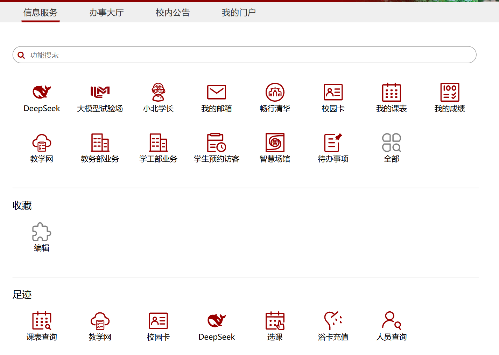

# PKU Course Crawler

北京大学课程信息爬取工具（Python脚本+Jupyter Notebook版本）

旨在为 [pkuhub.cn](https://pkuhub.cn/) 提供完整课程信息, 同时也方便同学们选课和提前了解课程安排. 

## 特性

- 🕸️ 基于Selenium的网页自动化爬取
- 🔐 北大门户账号登录, 无外泄风险
- ⚙️ 可配置学年/院系/学期/学生类型过滤
- 📈 Notebook版本含数据处理和分析功能
- 🤖 自动管理ChromeDriver

## 环境要求

- Python 3.7+
- Chrome浏览器
- 北大信息门户

```bash
pip install pypinyin selenium webdriver-manager beautifulsoup4 requests pandas openpyxl
```

## 配置说明

修改`setting.json`文件：

```json
{
    "username": "学号",
    "password": "密码",
    "year": ["24-25"],
    "dept": ["00001-数学科学学院"],
    "term": ["第一学期"],
    "stu": ["本科生课表"]
}
```

### 字段说明

| 字段   | 说明         | 示例               | 空值行为         |
|--------|--------------|--------------------|------------------|
| year   | 学年         | ["24-25"]          |   \   |
| dept   | 院系编码-名称| ["00001-数学科学学院"] | 爬取所有院系 |
| term   | 学期编号     | ["第一学期"]  | 爬取所有学期     |
| stu    | 学生类型     | ["本科生课表"]     | 爬取所有类型     |

- 键值与门户网站课程查询页面完全一致. 

## 使用方式

- :star2: 使用脚本之前, 请先自行登录北大信息门户, 打开一次课程查询页面, 以确保 `课程查询` 出现在 `足迹` 栏
- 示例 : 


### 命令行版本

```bash
python main.py
```

执行流程：
1. 读取`setting.json`配置
2. 自动登录教学网
3. 按配置过滤数据
4. 爬取课程信息
5. 保存结果文件

### Jupyter Notebook版本

`main.ipynb`包含：
- 完整的爬虫功能
- 增强数据处理功能：
  - 🧹 数据清洗
  - 📉 可视化分析
  - 📤 多格式导出

使用步骤：
1. 启动Jupyter Notebook
2. 打开`main.ipynb`
3. 按顺序执行代码单元

## 输出文件

- `课程数据汇总.xlsx`：包含所有课程信息

## 📜 许可证声明

本项目采用 **MIT License**，主要考虑因素：
1. 允许学术研究使用
2. 禁止商业用途
3. 使用者需自行承担合规风险

完整许可证见项目根目录 `LICENSE` 文件